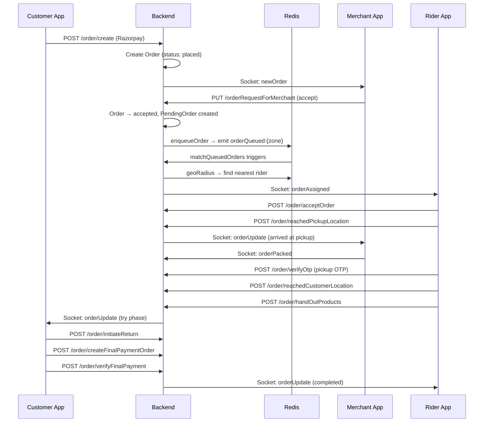

# FlashFits — System Architecture

> Auto-generated by /map on 2026-03-04
> **Try & Buy Fashion Delivery Platform**

---

## Overview

FlashFits is a **Try & Buy** fashion e-commerce platform where customers order clothing, a rider delivers it for trial, and the customer pays only for items they keep. The system consists of **5 applications** sharing a single backend.

```
┌─────────────────────────────────────────────────────────────────┐
│                    CLIENTS (4 APPS)                              │
│  ┌──────────┐ ┌──────────────┐ ┌──────────┐ ┌──────────────┐   │
│  │ Customer │ │   Merchant   │ │  Rider   │ │ Admin Panel  │   │
│  │ Expo RN  │ │ React/Vite   │ │ Expo RN  │ │ React/Vite   │   │
│  └─────┬────┘ └──────┬───────┘ └────┬─────┘ └──────┬───────┘   │
│        │             │              │               │           │
│        └─────────────┼──────────────┼───────────────┘           │
│                      │ HTTP + WebSocket                         │
├──────────────────────┼──────────────────────────────────────────┤
│                BACKEND (Node.js / Express 5)                    │
│  ┌──────────────────────────────────────────────────────────┐   │
│  │  Routes → Controllers → Models (Mongoose) → MongoDB      │   │
│  │  Socket.IO ← Redis Adapter (pub/sub + geo)               │   │
│  │  Cloudinary (images) • Razorpay (payments) • Twilio (OTP)│   │
│  └──────────────────────────────────────────────────────────┘   │
├─────────────────────────────────────────────────────────────────┤
│  INFRASTRUCTURE                                                 │
│  MongoDB Atlas │ Upstash Redis │ Cloudinary │ Razorpay │ Twilio │
└─────────────────────────────────────────────────────────────────┘
```

---

## Project Locations

| App | Path | Tech |
|-----|------|------|
| **Backend** | `FF Project/Backend` | Node.js, Express 5, Mongoose, Socket.IO |
| **Admin Website** | `FF Project/website/FFmanagement` | React 19, Vite, ShadCN UI |
| **Merchant App** | `MerchantModule` | React 19, Vite, TypeScript, MUI, Tailwind |
| **Rider App** | `FlashFits-Delivery-App` | React Native 0.81, Expo 54, NativeWind |
| **Customer App** | `FlashFits` | React Native 0.81, Expo 54, NativeWind |

---

## Backend Architecture

### Models (14 Mongoose Schemas)

| Model | File | Purpose |
|-------|------|---------|
| **User** | `user.model.js` | Customer with embedded addresses, phone login, role enum |
| **Merchant** | `merchant.model.js` | Shop with GeoJSON location, KYC, bank details, earnings, operating hours |
| **DeliveryRider** | `deliveryRider.model.js` | Rider with documents (Aadhaar/License/PAN), training, bank details, live geo location, zone assignment |
| **Order** | `order.model.js` | Full order lifecycle: 14+ statuses, items with tryStatus, finalBilling, OTP, trial phase timers, delivery tracking, Razorpay IDs |
| **Product** | `product.model.js` | Products with variants (color/size/stock/MRP/price/images/discount), matching products, features map, gender, isTriable |
| **Cart** | `cart.model.js` | Single-merchant enforced cart with product/variant/size/quantity/stock items |
| **Category** | `category.model.js` | 3-level hierarchy (parentId, level 0/1/2) with image/logo/title_banner |
| **Brand** | `brand.model.js` | Brand with logo, createdByType (Admin/Merchant), verification status |
| **Address** | `address.model.js` | Standalone address collection with GeoJSON Point, 2dsphere index |
| **Wishlist** | `wishlist.model.js` | User-product-variant with snapshot, unique index per user+variant |
| **Zone** | `zone.model.js` | Delivery zones with Polygon boundaries and center Point, 2dsphere indexes |
| **PendingOrder** | `pendingOrders.model.js` | Rider allocation queue: FIFO per zone, GeoJSON pickup/customer locations |
| **OTP** | `otp.model.js` | OTP storage for phone verification |
| **TitleBanner** | `title_banners.model.js` | Homepage banners tied to categories |

### Controllers (20 files, 4 role groups)

| Group | Controllers | Key Functions |
|-------|-------------|---------------|
| **Admin** (7) | brand, cart, category, merchant, product, titleBanner, zone | CRUD for all catalog entities, zone management with overlap checking |
| **User** (6) | auth, product, cart, order, address, wishlist | Google/phone login, product browsing/filtering, cart ops, Razorpay order creation/verification, final payment, address CRUD, wishlist |
| **Merchant** (4) | auth, merchant, product, order | Email OTP auth, shop/bank/hours setup, full product+variant CRUD with image upload, order accept/pack |
| **Rider** (2) | auth, orderController | Phone+OTP registration, document upload, bank details, order accept/pickup OTP verify/reach customer/hand out/end trial/return OTP verify |

### Routes (5 files)

| Route File | Prefix | Endpoints |
|------------|--------|-----------|
| `user.routes.js` | `/api/user` | 25+ endpoints: auth, products, cart, wishlist, orders (Razorpay), addresses |
| `merchant.routes.js` | `/api/merchant` | 30+ endpoints: auth, shop setup, products+variants CRUD, orders |
| `deliveryRider.routes.js` | `/api/rider` | 11 endpoints: register, OTP verify, personal details, documents, bank, 7 order flow steps |
| `admin.routes.js` | `/api/admin` | 18 endpoints: categories, merchants, brands, products, title banners, zones |
| `auth.routes.js` | `/api/auth` | Shared auth utilities |

### Real-Time (Socket.IO + Redis)

| Socket File | Purpose |
|-------------|---------|
| `merchant.socket.js` | Merchant online/offline tracking via Redis meta, join `merchant:{id}` room, newOrder notifications |
| `deliveryRider.socket.js` | Rider registration, live location updates via Redis GEO, zone-based availability, order accept/decline, heartbeat, reconnection with active order resume |
| `order.socket.js` | Order room management, broadcast `orderUpdate` to merchant + orderId rooms |
| `user.socket.js` | User disconnect handler with order room cleanup |

### Helper Functions (5 files)

| File | Purpose |
|------|---------|
| `deliveryRiderFns.js` | Redis GEO operations (`geoAdd`, `geoRadius`), rider meta get/set, heartbeat, distributed locking, `assignNearestRider` with zone-aware matching |
| `orderFns.js` | `enqueueOrder` (save PendingOrder + emit zone event), `matchQueuedOrders` (FIFO batch matching in zone) |
| `deliveryChargeFns.js` | Haversine distance calculation, delivery charge formula (₹18/km + ₹10), estimated time calculator |
| `calculateFinalBilling.js` | Final billing: accepted items total, overtime penalty (₹1/min over 10min), return charge deduction logic |
| `merchantFns.js` | Merchant Redis meta helpers |

### Middleware & Utils

| File | Purpose |
|------|---------|
| `jwtAuth.js` | JWT auth middleware for User, Merchant, Rider (3 separate middleware functions) |
| `multer.js` | File upload with Cloudinary storage |
| `error.middleware.js` | Global error handler |
| `ApiError.js` / `ApiResponse.js` | Standardized error/response utilities |
| `asyncHandler.js` | Express async wrapper |
| `zoneInfer.js` | Infer delivery zone from GPS coordinates |
| `product.validator.js` | Joi validation for products |

### Config (6 files)

| File | Purpose |
|------|---------|
| `db.js` | Mongoose connection |
| `redisConfig.js` | Upstash Redis client with in-memory index |
| `socket.js` | Socket.IO server init with Redis adapter |
| `cloudinary.config.js` | Cloudinary upload config |
| `RazorPay.js` | Razorpay instance |
| `cors.js` | CORS configuration |

---

## Order Flow (Try & Buy Lifecycle)

```
Customer Places Order (pays delivery fee via Razorpay)
  │
  ▼
Order Status: placed → Merchant notified via Socket.IO
  │
  ├─ Merchant Declines → cancelled, refund
  │
  ▼ Merchant Accepts → accepted
  │  PendingOrder created, zone-based rider matching starts
  │
  ▼ Rider Assigned → en route to pickup
  │  Rider gets live navigation, location broadcast to customer
  │
  ▼ Rider Arrives at Merchant → arrived at pickup
  │
  ▼ Merchant Packs → packed (rider notified)
  │
  ▼ Rider Verifies Pickup OTP → picked & verified order
  │  Status: out_for_delivery, en route to delivery
  │
  ▼ Rider Reaches Customer → arrived at delivery
  │
  ▼ Products Handed Out → try phase
  │  Trial timer starts (8 min free, then ₹1/min)
  │
  ▼ Customer Selects Buy/Return per item → completed try phase
  │
  ├─ All Kept → Final payment via Razorpay → completed
  ├─ Partial Return → Pay for kept items, rider returns rest to merchant → OTP verify → completed
  └─ Full Return → Rider returns all to merchant → OTP verify → completed
```

### Key Status Enums

**orderStatus:** `placed` → `accepted` → `packed` → `out_for_delivery` → `arrived at delivery` → `try phase` → `completed try phase` → `otp-verified-return` → `reached return merchant` → `completed`

**deliveryRiderStatus:** `unassigned` → `assigned` → `en route to pickup` → `arrived at pickup` → `picked & verified order` → `en route to delivery` → `arrived at delivery` → `try phase` → `completed try phase` → `otp-verified-return` → `reached return merchant` → `confirmed return` / `confirmed purchase` → `completed`

---

## Customer App (FlashFits)

**Tech:** Expo 54, React Native 0.81, NativeWind, Firebase, Socket.IO

### Screens

| Section | Screens | Purpose |
|---------|---------|---------|
| **Auth** | Login, OTP Verification | Phone-based auth with Firebase |
| **Tabs** | Home, Categories, FlashfitsStores, Wishlist | Main browsing experience |
| **Stack** | ProductDetail, StoreDetail, SelectionPage, MainSearchPage, ShoppingBag, Payment, OrderTracking, TimerTrial, ReturnItems, HandoverModal, ConfirmSelectionModal | Product detail, shopping flow, order tracking |
| **Profile** | Profile, Address, Orders, Coupons, MyWallet, HelpAndSupport | User account management |

### Components (41)

Home (Banner, Carousel, Card, TopCategory, ShopCards, SmoothSlider, RecentlyViewed, PopupCart, FootwearSection, HomeCategorySwitcherShops, ParentCategoryIndexing), Cart/Bag (BagProduct, CheckoutPage, HeaderBag, SelectAddressBottomSheet), Checkout (HeaderCumAddressSection, PaymentOptions, ReviewItemCards, SlideToPay), Product Detail (ProductDetail, ReviewScoreSection, YouMayLike, CardYouMayLike), Nearby Shops (CardinStores, NearbyHeaderBar, NearbyStores, PopularStores), Shop Detail (FeaturedDress, ShopOffersCarousel), Wishlist (HeaderWishlist, WhishlistCard), Auth (Login, OtpInput), Common (SearchCartProfileButton, HowFlashFitsWorks, Footer, Loader)

### APIs (6 files)

`auth.js`, `categories.js`, `getMerchantHome.js`, `orderApis.js`, `cartProduct.js`, `products.js`

---

## Merchant App (MerchantModule)

**Tech:** React 19, Vite 7, TypeScript, MUI, Tailwind, Recharts, Leaflet, Socket.IO

### Pages (5)

| Page | Purpose |
|------|---------|
| `AddBrandPage` | Create new brands with logo upload |
| `AddNewProduct` | Multi-step product creation with variants |
| `InventoryPage` | View/manage all products and stock |
| `OrderManagement` | Accept/decline/pack orders with real-time Socket.IO updates |
| `Revenue` | Revenue analytics with Recharts charts |

### Key Components

- **Login/Register:** Email OTP auth, Google OAuth, shop registration with map selector for location (Leaflet), logo crop
- **Products:** AddVariant, EditProductPage, VariantForm, DynamicSizesInput, ProductTable
- **Brands:** AddBrandForm, BrandTable
- **UI Utils:** CropperModal, ConfirmDialog, OnlineToggle, Modal
- **Navigation:** Navbar, Sidebar

### Context (3)

`AuthContext`, `NotificationContext`, `ConfirmDialogContext`

### APIs (3)

`auth.ts`, `order.ts`, `products.ts` — with `axiosInstance.ts` base config

### Sockets

`orderListeners.ts` — listens for `newOrder`, `orderUpdate`, `riderAssigned` events with siren sound notifications

---

## Rider App (FlashFits-Delivery-App)

**Tech:** Expo 54, React Native 0.81, NativeWind, expo-camera, expo-location, Socket.IO

### Screens (14+ Order Flow Steps)

| Section | Screens | Purpose |
|---------|---------|---------|
| **Auth** | Login → OTP Verification | Phone-based registration |
| **Register** | Multi-step registration | Personal details, document upload (Aadhaar/License/PAN), bank details |
| **Home** | Dashboard, Earnings, More | Order status cards, daily progress, earnings summary |
| **Order Flow** | AcceptOrder → PickupDetails → ReachPickup → DeliveryDetails → ReachDeliveryLocation → ReturnItemCamera → ReturnVerification → MerchantReturnVerification → EarningsSummary | Complete delivery lifecycle |
| **Profile** | Rider profile | Account management |

### Components (8)

AnimatedTabIcon, Login, OTPVerificationScreen, DailyProgressCard, DeliveryStatusCard, NavBarHomeScreen, OrderInProgressCard, AnimatedDots

### APIs (3)

`auth.js`, `orderFlow.js`, `registration.js`

### Hooks & Utils

`useLocationPermission.js`, `updateLocation.js` (background location updates)

### Config

`axiosConfig.js`, `socketConfig.js` — Socket.IO connection with auto-reconnect

---

## Admin Website (FFmanagement)

**Tech:** React 19, Vite, ShadCN UI, Tailwind

### Pages (16)

| Page | Purpose |
|------|---------|
| `Dashboard` | Admin overview |
| `Category` / `AddCategory` / `EditCategory` | 3-level category CRUD with image/logo/banner |
| `Merchants` / `AddMerchants` / `EditMerchant` | Merchant onboarding and management |
| `Products` / `AddProducts` / `MatchingProducts` | Product catalog management |
| `Variants` / `AddVariants` / `VariantsImageUploader` | Variant management with multi-image upload |
| `AddBrand` | Brand creation |
| `CreateZone` | Delivery zone setup with polygon drawing |
| `Title_Banner` | Homepage banner management |
| `MerchantDashboard` / `AddProduct` (merchant layout) | Merchant-specific views |

### Layouts (2)

`AdminLayout` — full admin panel with Sidebar  
`MerchantLayout` — merchant-specific dashboard  

### APIs (6)

`brand.js`, `categories.js`, `merchants.js`, `products.js`, `title_banner.js`, `zone.js`

---

## Integration Points

| Service | Type | Purpose |
|---------|------|---------|
| **MongoDB Atlas** | Database | Primary data store |
| **Upstash Redis** | Cache/Pub-Sub | Rider geo-tracking, merchant online status, rider meta, heartbeats, distributed locks, Socket.IO adapter |
| **Cloudinary** | Media Storage | Product images, brand logos, category images, rider documents, merchant logos |
| **Razorpay** | Payments | Delivery fee payment, final product payment, webhooks |
| **Twilio** | SMS | OTP delivery for phone verification |
| **Firebase** | Auth (Customer) | Google sign-in for customer app |
| **Socket.IO** | Real-time | Order updates, rider location, merchant notifications, zone-based rider matching |

---

## Data Flow — Order Lifecycle



---

## Technical Debt

- [ ] `zoneInfer.js` has hardcoded zone name `"Kadavanthara"` instead of dynamic inference
- [ ] Duplicate `isOnline` field in merchant schema (defined twice)
- [ ] Duplicate enum value `'completed'` in orderStatus enum
- [ ] Some controller functions use `try/catch` while others use `asyncHandler` — inconsistent error handling
- [ ] Rider disconnect handler iterates all `rider:*:meta` Redis keys — O(n) scan
- [ ] `user.socket.js` is minimal — no order room join on user connect
- [ ] Cart model has `stockQuantity` stored per item (may become stale)
- [ ] No input validation on many merchant and admin routes
- [ ] `updateStock` route is registered twice on same path in merchant routes
- [ ] Customer app uses both `@react-navigation` and `expo-router` — mixed navigation paradigms
- [ ] No rate limiting on auth-related routes
- [ ] Missing TypeScript in Backend and Admin Website

---

## Conventions

**Naming:** camelCase for files, PascalCase for components  
**Structure:** Backend follows Controllers → Models pattern (no service layer). Frontend apps use file-based routing (Expo Router) or React Router.  
**Auth:** JWT tokens with role-based middleware (`authMiddleware`, `authMiddlewareMerchant`, `authMiddlewareRider`)  
**Real-time:** Socket.IO rooms per entity (`merchant:{id}`, `riderSocket:{id}`, `rider:{id}`, `order:{id}`)  
**Images:** All uploaded to Cloudinary via Multer middleware, stored as `{public_id, url}` objects  
**Payments:** Razorpay with server-side order creation and client-side verification  
